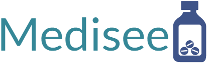
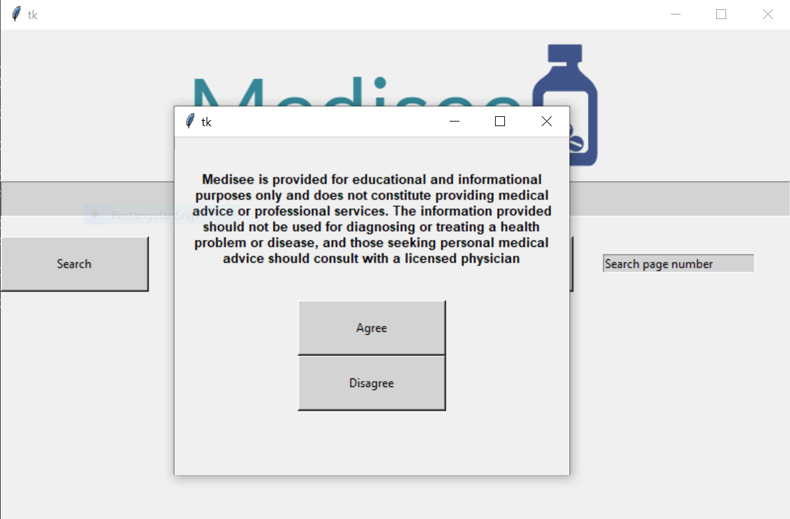
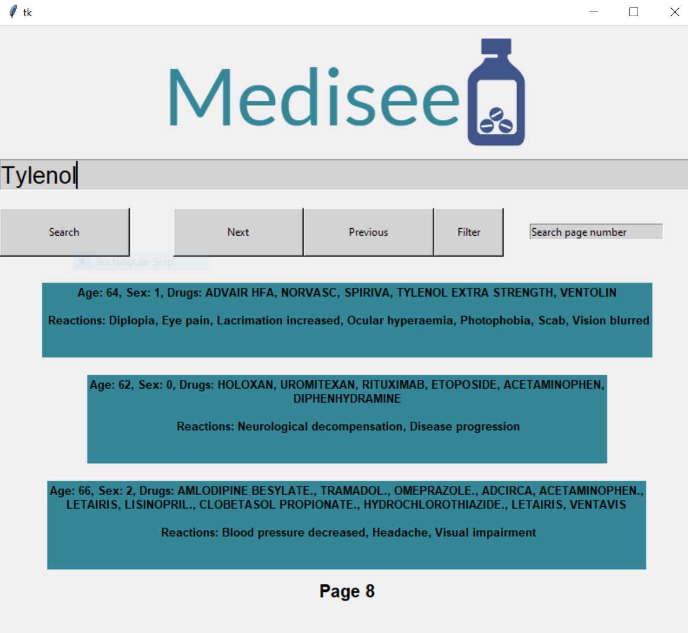

  

# About
Medisee is a program with the primary goal of enhancing transparency and accessibility within the field of medicine. It achieves this by visualizing anonymized case data related to adverse effects, which can be difficult for users to obtain due to their storage within the Federal Drug Administration (FDA) API. The mission at Medisee is to provide users with visualizations that help them have a better understanding of medicine-related adverse events. 

# Features 
* Transforms FDA API data into visual representations
* 1000 drug/reaction cases per query
* Filters to narrow down cases and focus on user criteria
* user-friendly GUI

# Requirements
* Python (See Requirements.txt)
* Python Interpreter
* Network Connection
* Command Prompt

# Installation and Usage
1. Begin by downloading the repository and extracting it to your preferred location.
2. Open a terminal and navigate to the repository directory using the "cd Path/to/folder/Medisee" command.
3. Run the command pip install -r requirements.txt command.
4. To execute the program, enter the following command: python gui.py.
5. Users will encounter a medical disclaimer. They can choose to agree and continue or disagree to terminate the program.

  

6. Input your medicinal query and, if needed, apply filters. When you're ready, click the "Search" button.
7. Use the "Next" and "Previous" buttons to navigate through the results. To find specific pages, use the "Page Finder" entry.

  

# Technology
## Python (Tkinter)
* Requests library for fetching data from the FDA API, and Tkinter for creating an intuitive graphical user interface (GUI) to present the information.

# Contributions
Medisee is an open-source project and welcomes contributions from developers. Together, we can continue breaking down barriers between patients and essential medicinal data by adding new features and improving existing ones.

# Future
A feature reserved for future development is scanning medicine and querying it by its NDC (National Drug Code) to provide even more detailed information. In response to the needs of elderly users, I seek to the implementation of a text enlarger, making it easier for elders to read small text on medicinal products.
